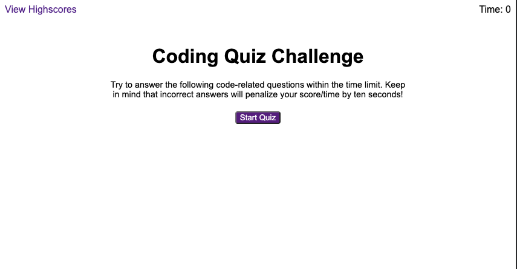

# Coding Quiz Challenge

## Description

The purpose of this project is to represent a typical coding assessment that could be used in potential future job interviews. This assessment is consists of five multiple-choice questions that are timed. Each correct answer is worth 10 points, with the final score totaling points earned plus the amount of time remaining when the quiz is completed.

## Installation

The project can be found at the following GitHub Page: https://j-preim.github.io/code-quiz/

## Usage

The website will appear as it does in the following screenshot:

## Credits

The code used on line 256 of script.js was sourced from this page:
https://stackoverflow.com/questions/1129216/sort-array-of-objects-by-string-property-value

The code used for the function on line 176 of script.js was sourced from this page:
https://byby.dev/js-add-event-listener

## License

Copyright (c) 2023 Joe Preimesberger

Licensed under the MIT license.